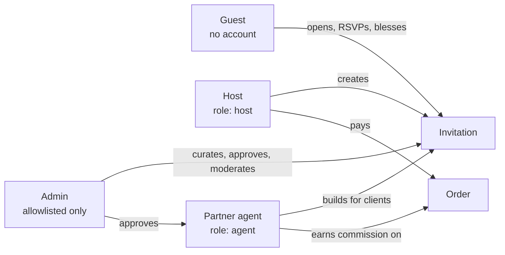
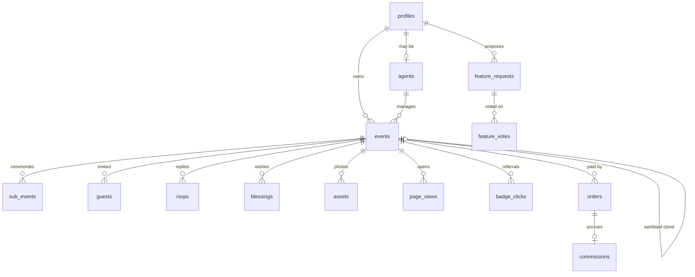
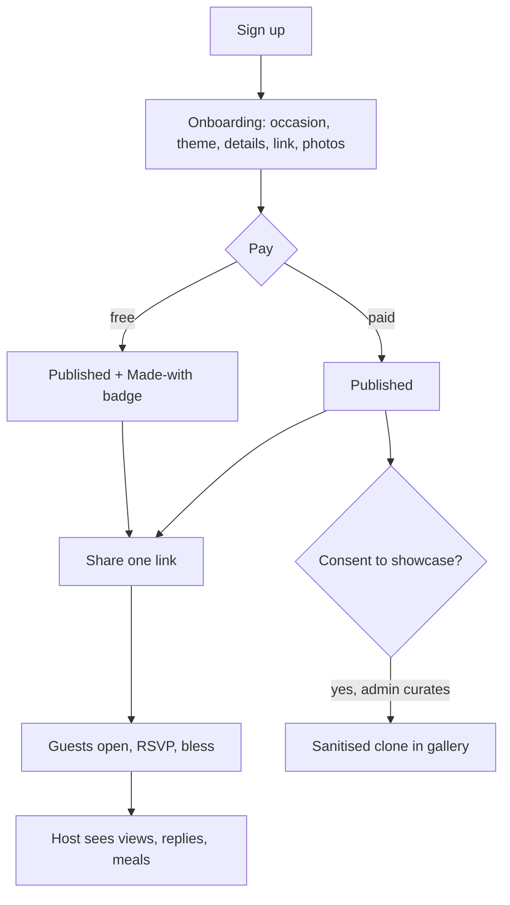
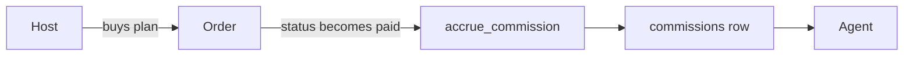
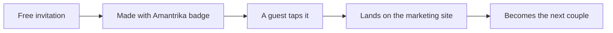

# Amantrika — project graph

A single place that holds **what this product is**, how its pieces relate, and
which rules must not be broken. Written to be read cold, by a person or a model,
with no prior context.

> Three documents, three jobs. **This** one is the *idea and the shape*.
> `ARCHITECTURE.md` is *where the code lives*. `progress.md` is *what is done
> and what is next*. Update this one when the product's shape changes — new
> entity, new actor, new rule — not for ordinary features.

---

## 1. What it is, in one paragraph

Amantrika turns a wedding invitation into a link. A couple builds an animated
invitation website that opens like a physical card — wax seal, envelope, petals —
shares one URL with every guest, and collects RSVPs, blessings and view counts in
return. It began wedding-only and is now occasion-agnostic: the same tables serve
a birthday, a housewarming or a corporate launch. It sells to two audiences at
once — couples directly, and planners who build for couples.

**The wedge:** a printed card is an object; a digital invitation is a service.
The product does not try to beat paper at being beautiful. It wins on the things
paper cannot do — correcting a venue after sending, reaching a cousin abroad the
same day, and knowing who is coming.

---

## 2. Actors

| Actor | Has an account | Can |
| --- | --- | --- |
| **Guest** | No, ever | Open an invitation, RSVP, leave a blessing, vote on the roadmap |
| **Host** | Yes | Create and manage their own celebrations |
| **Agent** | Yes, **approved by hand** | Build invitations for clients, earn commission |
| **Admin** | Yes, **email allowlist only** | Everything, plus curation and moderation |

**A guest never signs in.** That is a product rule, not an oversight — asking a
grandmother to create an account to say she is coming would lose her.

---

## 3. Domain model

### The central idea: `events` is the tenant

Everything hangs off one row. A wedding's two partners live in `events.hosts`
(**jsonb**), not in `partner1`/`partner2` columns — which is why a birthday with
one celebrant and a corporate launch with three hosts need no schema change.
Ceremonies are `sub_events` rows, so "haldi, mehndi, sangeet" and "keynote,
sessions, networking" are the same shape.

### Two jsonb columns that are not the same thing

| Column | Holds | Semantics |
| --- | --- | --- |
| `events.settings` | Feature switches — RSVP on, countdown on | Ours to change |
| `events.permissions` | Host **consent** — showcase, anonymise | Theirs; withdrawable, audited |

Keeping consent out of settings is deliberate. Consent has different rules: it
must be auditable, it must be withdrawable, and it must never be changed on the
host's behalf.

---

## 4. The lifecycle

`draft → published → archived`. **Archived is load-bearing**, not just tidy:
showcase clones are archived so the ordinary "public reads published events" rule
cannot serve them, and only the narrower showcase policy can.

---

## 5. Rules that must not be broken

These are the decisions where a well-meaning change does real harm.

### Privacy

1. **A guest's details never leave Postgres.** Names, phones, RSVP messages and
   blessings are never sent to any analytics service. Analytics carries counts,
   enums, booleans and ids — never people.
2. **Visitor counting uses a salted daily hash** of IP + user-agent. Enough to
   say fifty people looked rather than five; useless for following anyone across
   days. *(Roadmap voting is the deliberate exception — see §6.)*
3. **The showcase publishes a sanitised clone, never the live invitation.**
   Address reduced to a city, phones and payment details stripped, guests and
   RSVPs never copied. The gallery never links to a family's real page.
4. **Consent is default-off and only makes an invitation eligible.** An admin
   still curates. Withdrawal deletes the clone immediately.

### Security

5. **RLS is the boundary.** Middleware redirects and page guards are courtesy;
   if they ever disagree with RLS, RLS wins and that is correct.
6. **Admin is an email allowlist enforced by a database trigger.** `role='admin'`
   is impossible for any other address regardless of write path.
7. **Agents are approved by hand.** A partner can manage other people's
   invitations, so it is never self-service.

### Product

8. **A guest never needs an account.** No login, no OTP, no app.
9. **An invitation carries no advertising** beyond the "Made with Amantrika"
   badge on the free tier, which is hidden in print.
10. **The badge is a corner pill, not a tiled watermark.** Defacing a family's
    invitation makes guests resent the mark rather than follow it — and following
    it is the entire point.

---

## 6. The one deliberate inconsistency

Roadmap voting uses a **stable** salted IP hash, while view counting uses a
**daily-rotating** one.

This looks like a bug and is not. A rotating hash would let the same person vote
again every day, which defeats "one vote per person". The cost is that a shared
office or carrier NAT collapses several people into one voter. That is accepted:
the alternative is making people sign in to express a preference, which loses
most of the signal. Identity, where it is genuinely needed — the contributor
leaderboard — uses accounts instead.

---

## 7. Surfaces

| Surface | Audience | Chrome | Notes |
| --- | --- | --- | --- |
| `/` `/blog` `/showcase` `/roadmap` | Public, indexed | Site header/footer | Marketing |
| `/invite/[slug]` | **Guests** | **None** | The couple's page, not ours |
| `/onboarding` | Host | Stepper | 7 steps |
| `/dashboard` `/dashboard/[id]` | Host | Dashboard shell | Analytics, guests, photos |
| `/agent` | Partner | Dashboard shell | Clients, referrals, commission |
| `/admin/*` | Admin | Dashboard shell | Curation, approvals, platform analytics |
| `/profile` | Any member | Dashboard shell | Details, become-a-partner |
| `/design-system` | **Developers** | Docs shell | **Local only** — 404 on any deployment |

---

## 8. Money

Plans live in Postgres (`plans`) because checkout reads them — the one piece of
marketing copy that is not MDX. Payments go through a provider interface
(`src/lib/payments/`) so the concrete gateway is one env var, not a rewrite.
Commission accrues by database trigger the moment an order is marked paid, so it
cannot drift from revenue.

**Partner economics:** buy at a discount, sell at the normal price, keep the
difference. Stated with a real number in the UI rather than "earn money with us",
because a number people can check produces partners who stay.

---

## 9. Growth loop

The only organic one, and worth protecting:

Every tap is recorded per invitation (`badge_clicks`), so admin can see *which*
invitations actually refer people — not just that referrals happen.

---

## 10. Glossary

| Term | Means |
| --- | --- |
| **Invitation / event** | One celebration. Row in `events`. The tenant object. |
| **Sub-event** | A ceremony within it — haldi, nikah, keynote. |
| **Host** | The person whose celebration it is. Owns the row. |
| **Agent / partner** | Builds invitations for clients; earns commission. |
| **Clone** | The sanitised copy published to the showcase. Never the original. |
| **Badge** | The "Made with Amantrika" pill on free invitations. |
| **Blessing** | A guest's written wish. The guestbook. |
| **Demo invites** | Bundled samples in `src/data/`, not database rows. Keep marketing links alive on an empty database. |

---

## 11. Where the bodies are buried

Hard-won facts. Each cost real time; none is guessable from the code.

- **`events` ↔ `assets` has two foreign keys.** An unqualified PostgREST embed is
  ambiguous, fails with `PGRST201`, and surfaces as an **empty result rather than
  an error**. Always pin `assets!assets_event_id_fkey(...)`.
- **A server component cannot call a function from a `"use client"` module.** It
  can render it or pass props. This has broken `/admin` once and `roleLabels`
  once. Pure helpers go in a plain module.
- **`unstable_cache` forbids reading cookies**, so cached public reads must use
  `createPublicClient()`, not `createClient()`.
- **Next inlines `process.env` into middleware and static bundles at build time.**
  An env-based feature flag freezes to whatever the build machine had — gate on
  request data (the host header) instead.
- **`supabase config push` sends the whole local `[auth]` block** and once
  silently disabled email confirmation. Read the diff.
- **Never renumber an applied migration.** Rename a late arrival forward instead.
- **Two agents in one checkout corrupt each other's `.next`.** Build with
  `NEXT_DIST_DIR=.next-claude`. The symptom is `Cannot find module for page: /x`
  across several unrelated routes — it looks like broken code and is not.
- **`assets.storage_path` is unique per *event*, not globally.** It was global
  once, which meant a showcase clone could never copy a photograph: the clone
  references the same stored object as its source, the insert hit a 23505, the
  whole call rolled back, and curation surfaced as a button that did nothing.
- **Diagnose RLS and `security definer` failures under the caller's session**,
  not as postgres. As postgres `auth.uid()` is null, so an admin-only function
  raises "only an administrator" and hides the real error underneath:
  `set local role authenticated; set local request.jwt.claims = '{"sub":"<uuid>"}';`
- **"Serializing big strings" is a warning, not an error.** It concerns
  webpack's build cache, not the bundle. Silenced via
  `infrastructureLogging.level`, which leaves compilation warnings intact.
